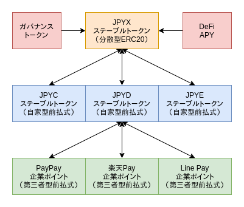

# JPYX 国内合法DeFi

日本全国１億３０００万人にERC20をマスアダプションさせる

## JPYX 特徴

1. 企業の信用に担保された前払式支払手段ERC20日本円ステーブルトークンをバスケットにした分散型日本円ステーブルトークンのDEX。
2. バスケットトークンをステーキングすることによって受け取るJPYXは、保有しているだけでDeFiの自動運用APYとスワップ手数料から配当を得ることができます。
3. 各バスケットトークンは常に1:1で相互交換できます。
4. 各トークンのバスケット比率を70%以上にする流動性供給やスワップはできません。
5. バスケットバランスを改善するスワップには手数料がかかりません。
6. PayPay支払いでJPYDを購入することができます。Chainlinkオラクルを利用したセキュアで自動化されたフローです。

## ロードマップ

1. 外部DeFiで自動運用するためのアダプターコントラクト開発
2. ガバナンスによるバスケットトークンの選定やパラメータ管理
3. コントラクトのアップグレーダビリティ
4. 廃止トークンやペッグの外れたトークンの清算プロセス

## デモ （Kovan Testnet）

[jpyc-ocrybit.vercel.app](https://jpyc-ocrybit.vercel.app/)

## 関連リンク

- [日本円ハッカー部](https://hide.ac/topics/vJd6hY17Y)

- [Discord](https://discord.com/invite/fv23hksx4S)

- [第１回JPYCハッカソン最優秀賞](https://hide.ac/articles/W0a3rm_Oo)
